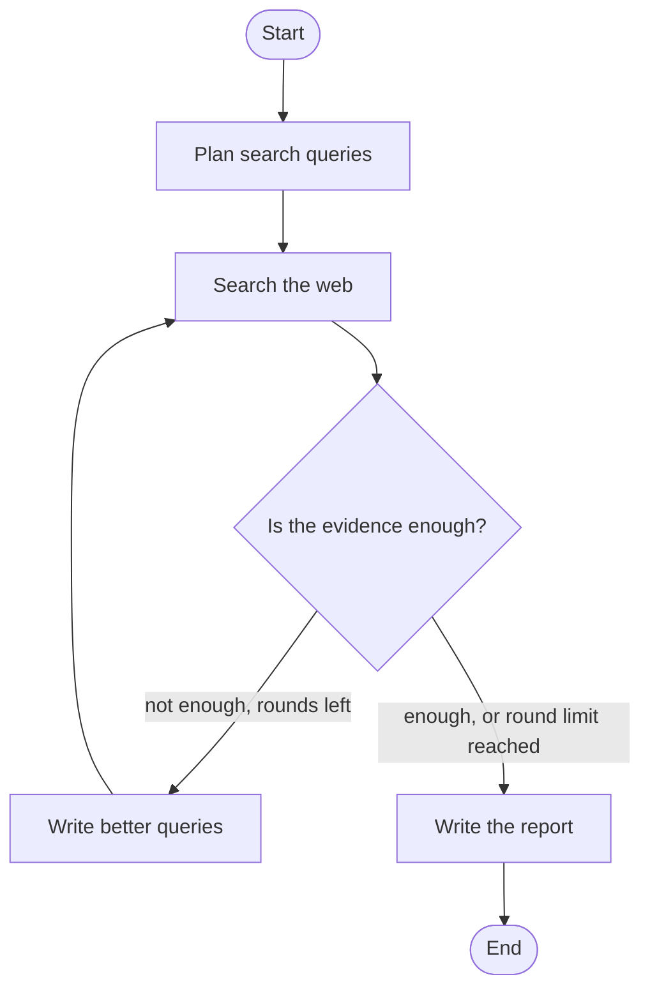

# Research Agent

An AI agent that researches a topic on the web, **checks its own evidence**, searches again if the evidence is weak, and writes a sourced report. If the web does not cover the topic, it says so instead of making something up.

Built as a hands-on project to learn agentic AI with LangGraph.

## Screenshots


## How it works



1. **Plan:** the LLM writes 3 search queries that cover different angles of the topic.
2. **Search:** Tavily runs each query, and duplicate pages and low-quality sites are removed.
3. **Check:** the LLM acts as a strict reviewer and decides if the sources are enough to write a good report.
4. **Refine:** if not, it writes new queries to fill the gaps and searches again (at most 2 extra rounds).
5. **Write:** the LLM writes a report using only the collected sources. If the reviewer said the evidence is weak, the report states this plainly.

## Key design decisions

- **Capped retry loop:** the agent can search again at most twice, which prevents endless loops and runaway API usage.
- **Honest failure:** with weak evidence, the report says "no relevant findings" and lists what could not be verified.
- **Topic-faithful writing:** the writer is told never to swap the topic for a neighboring one.
- **Sources built in code:** titles and URLs in the Sources list are added by Python, not typed by the LLM, so they always match the real pages. Citations are renumbered from 1.
- **Structured LLM output:** decisions come back as validated Pydantic objects, with automatic retries on bad JSON.
- **Rate-limit handling:** if the free tier says "too many requests", the agent waits and retries instead of crashing.

## Tech stack

Python, LangGraph, Groq (`openai/gpt-oss-120b`), Tavily, Pydantic, Streamlit

## Setup

```bash
git clone https://github.com/Jagruti2004deore/research-agent.git
cd research-agent
python -m venv venv
venv\Scripts\activate        # Windows
pip install -r requirements.txt
```

Copy `.env.example` to `.env` and add your free keys:

```
GROQ_API_KEY=your_groq_key_here
TAVILY_API_KEY=your_tavily_key_here
```

- Groq key: console.groq.com
- Tavily key: tavily.com

## Run

Web app:
```bash
streamlit run app.py
```

Terminal version:
```bash
python test_agent.py solid-state batteries
```

## Project structure

| File | Purpose |
|---|---|
| `config.py` | Loads API keys and the model name |
| `state.py` | The agent's shared state and structured-output models |
| `prompts.py` | All LLM instructions in one place |
| `llm_utils.py` | Structured JSON output and rate-limit waiting |
| `nodes.py` | One function per step (plan, search, check, refine, write) |
| `graph.py` | Connects the steps into a LangGraph with the retry loop |
| `app.py` | Streamlit web interface with live step display |
| `test_agent.py` | Runs the agent from the terminal and saves `report.md` |

## Example behavior

| Topic | What the agent does |
|---|---|
| `solid-state batteries` | Finds enough evidence in one round and writes a full cited report |
| `history of the abacus in rural Bhutan schools` | Searches 3 rounds, rejects off-topic sources each time, and reports that nothing relevant was found |

## Limitations

- The agent reads search snippets, not full web pages, so detail is limited.
- It trusts what Tavily returns. Some sources are still weak (blogs, mirrors), though known low-quality sites are blocked.
- On the free Groq tier, long runs may pause while waiting for the rate limit.
- Reports can still contain mistakes. Check important claims against the cited links.

## Ideas for next steps

- Read full pages for the best sources
- Score source quality before using it
- Save past reports and show a history tab
- Add evaluation tests with a fixed set of topics
